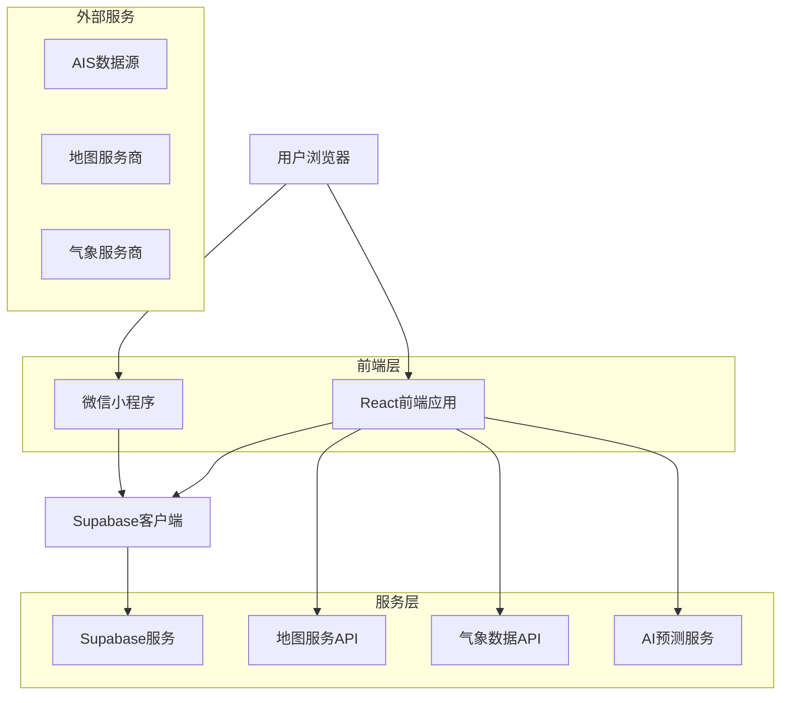
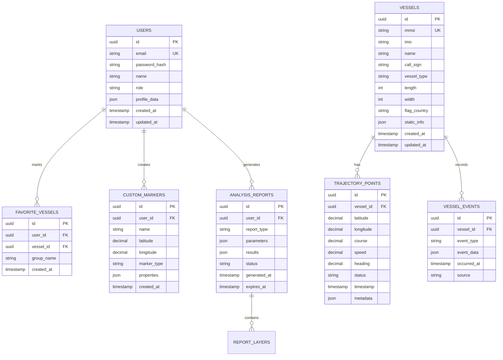
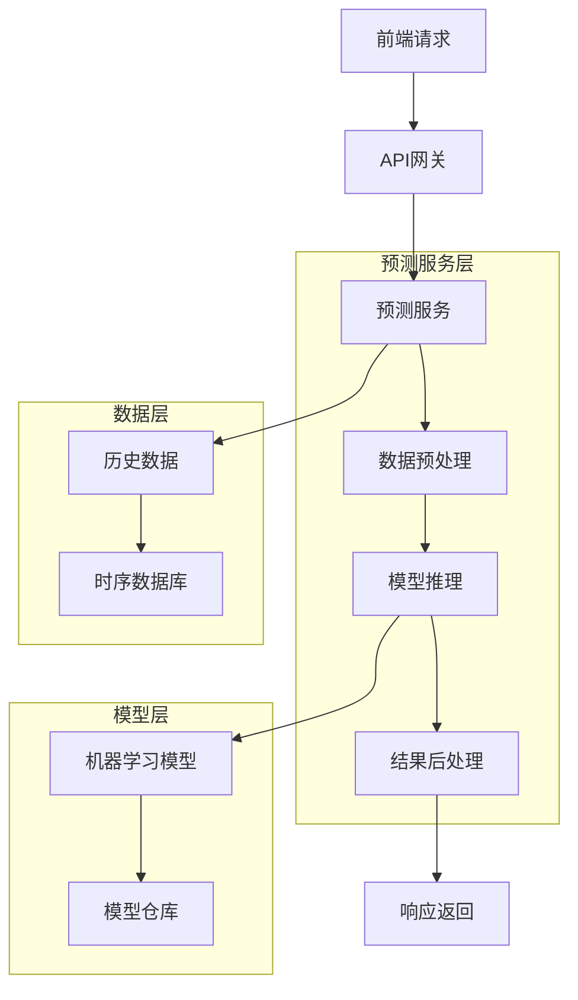

## 1. 架构设计



## 2. 技术描述

- **前端**: React@18 + TypeScript + TailwindCSS@3 + Vite
- **初始化工具**: vite-init
- **后端**: Supabase (BaaS)
- **地图引擎**: Leaflet + React-Leaflet (2D) / Three.js (3D场景)
- **状态管理**: React Context + Zustand
- **UI组件库**: Ant Design + 自定义组件
- **小程序**: 微信小程序原生开发
- **AI服务**: Python FastAPI (预测算法)

## 3. 路由定义

| 路由 | 用途 |
|-------|---------|
| / | 首页，全球船舶实时分布图 |
| /search | 船舶搜索页面 |
| /vessel/:id | 船舶详情页面 |
| /analysis | 分析工具页面 |
| /prediction | 预测推演页面 |
| /report | 数据报告页面 |
| /user/profile | 用户个人中心 |
| /user/favorites | 我的关注 |
| /user/markers | 我的标记 |
| /auth/login | 登录页面 |
| /auth/register | 注册页面 |
| /auth/reset | 密码重置页面 |

## 4. API定义

### 4.1 船舶数据API

**获取船舶实时位置**
```
GET /api/vessels/realtime
```

请求参数:
| 参数名 | 类型 | 必需 | 描述 |
|--------|------|------|------|
| bounds | string | 否 | 地图边界坐标 (sw_lng,sw_lat,ne_lng,ne_lat) |
| zoom | number | 否 | 地图缩放级别 |
| vessel_types | array | 否 | 船舶类型筛选 |
| time_range | string | 否 | 时间范围筛选 |

响应:
```json
{
  "vessels": [
    {
      "id": "vessel_123",
      "name": "COSCO SHIPPING",
      "mmsi": "123456789",
      "imo": "9876543",
      "position": {
        "latitude": 31.2304,
        "longitude": 121.4737
      },
      "course": 123.5,
      "speed": 15.2,
      "heading": 125,
      "status": "underway",
      "last_update": "2024-01-15T10:30:00Z",
      "destination": "Shanghai",
      "eta": "2024-01-16T08:00:00Z"
    }
  ],
  "total": 1250,
  "timestamp": "2024-01-15T10:35:00Z"
}
```

**获取船舶历史轨迹**
```
GET /api/vessels/:id/trajectory
```

请求参数:
| 参数名 | 类型 | 必需 | 描述 |
|--------|------|------|------|
| start_time | string | 是 | 开始时间 (ISO 8601) |
| end_time | string | 是 | 结束时间 (ISO 8601) |
| interval | number | 否 | 采样间隔 (分钟) |

### 4.2 分析工具API

**交通流分析**
```
POST /api/analysis/traffic-flow
```

请求:
```json
{
  "area": {
    "type": "polygon",
    "coordinates": [[...]]
  },
  "time_range": {
    "start": "2024-01-01T00:00:00Z",
    "end": "2024-01-31T23:59:59Z"
  },
  "analysis_type": "density",
  "grid_size": 0.1
}
```

响应:
```json
{
  "analysis_id": "analysis_456",
  "status": "completed",
  "result": {
    "density_map": "url_to_density_tile_layer",
    "statistics": {
      "total_vessels": 1250,
      "average_density": 15.3,
      "peak_hours": ["08:00", "18:00"]
    }
  },
  "generated_at": "2024-01-15T10:35:00Z"
}
```

**距离测量**
```
POST /api/analysis/distance
```

请求:
```json
{
  "points": [
    {"lat": 31.2304, "lng": 121.4737},
    {"lat": 32.0603, "lng": 118.7969}
  ],
  "measure_type": "sea_route"
}
```

### 4.3 预测API

**交通流预测**
```
POST /api/prediction/traffic-flow
```

请求:
```json
{
  "historical_years": 3,
  "prediction_years": 2,
  "region": {
    "type": "rectangle",
    "bounds": [120.0, 30.0, 125.0, 35.0]
  },
  "model_parameters": {
    "seasonality": true,
    "trend": true,
    "external_factors": ["economic", "weather"]
  }
}
```

## 5. 数据模型

### 5.1 数据库实体关系



### 5.2 数据定义语言

**用户表 (users)**
```sql
-- 创建用户表
CREATE TABLE users (
    id UUID PRIMARY KEY DEFAULT gen_random_uuid(),
    email VARCHAR(255) UNIQUE NOT NULL,
    password_hash VARCHAR(255) NOT NULL,
    name VARCHAR(100) NOT NULL,
    role VARCHAR(20) DEFAULT 'user' CHECK (role IN ('user', 'professional', 'enterprise', 'admin')),
    profile_data JSONB DEFAULT '{}',
    created_at TIMESTAMP WITH TIME ZONE DEFAULT NOW(),
    updated_at TIMESTAMP WITH TIME ZONE DEFAULT NOW()
);

-- 创建索引
CREATE INDEX idx_users_email ON users(email);
CREATE INDEX idx_users_role ON users(role);
```

**船舶表 (vessels)**
```sql
-- 创建船舶表
CREATE TABLE vessels (
    id UUID PRIMARY KEY DEFAULT gen_random_uuid(),
    mmsi VARCHAR(9) UNIQUE NOT NULL,
    imo VARCHAR(7),
    name VARCHAR(255) NOT NULL,
    call_sign VARCHAR(10),
    vessel_type VARCHAR(50),
    length INTEGER,
    width INTEGER,
    flag_country VARCHAR(3),
    static_info JSONB DEFAULT '{}',
    created_at TIMESTAMP WITH TIME ZONE DEFAULT NOW(),
    updated_at TIMESTAMP WITH TIME ZONE DEFAULT NOW()
);

-- 创建索引
CREATE INDEX idx_vessels_mmsi ON vessels(mmsi);
CREATE INDEX idx_vessels_name ON vessels(name);
CREATE INDEX idx_vessels_type ON vessels(vessel_type);
```

**轨迹点表 (trajectory_points)**
```sql
-- 创建轨迹点表
CREATE TABLE trajectory_points (
    id UUID PRIMARY KEY DEFAULT gen_random_uuid(),
    vessel_id UUID NOT NULL REFERENCES vessels(id),
    latitude DECIMAL(10,7) NOT NULL,
    longitude DECIMAL(10,7) NOT NULL,
    course DECIMAL(5,1),
    speed DECIMAL(5,1),
    heading DECIMAL(5,1),
    status VARCHAR(20),
    timestamp TIMESTAMP WITH TIME ZONE NOT NULL,
    metadata JSONB DEFAULT '{}',
    created_at TIMESTAMP WITH TIME ZONE DEFAULT NOW()
);

-- 创建索引
CREATE INDEX idx_trajectory_vessel_time ON trajectory_points(vessel_id, timestamp DESC);
CREATE INDEX idx_trajectory_location ON trajectory_points USING GIST (
    ST_MakePoint(longitude, latitude)
);
CREATE INDEX idx_trajectory_timestamp ON trajectory_points(timestamp DESC);
```

**分析报告表 (analysis_reports)**
```sql
-- 创建分析报告表
CREATE TABLE analysis_reports (
    id UUID PRIMARY KEY DEFAULT gen_random_uuid(),
    user_id UUID NOT NULL REFERENCES users(id),
    report_type VARCHAR(50) NOT NULL,
    parameters JSONB NOT NULL,
    results JSONB,
    status VARCHAR(20) DEFAULT 'pending' CHECK (status IN ('pending', 'processing', 'completed', 'failed')),
    generated_at TIMESTAMP WITH TIME ZONE,
    expires_at TIMESTAMP WITH TIME ZONE,
    created_at TIMESTAMP WITH TIME ZONE DEFAULT NOW()
);

-- 创建索引
CREATE INDEX idx_reports_user ON analysis_reports(user_id);
CREATE INDEX idx_reports_type ON analysis_reports(report_type);
CREATE INDEX idx_reports_status ON analysis_reports(status);
CREATE INDEX idx_reports_created ON analysis_reports(created_at DESC);
```

### 5.3 Supabase权限配置

```sql
-- 授予匿名用户基础读取权限
GRANT SELECT ON vessels TO anon;
GRANT SELECT ON trajectory_points TO anon;

-- 授予认证用户完整权限
GRANT ALL PRIVILEGES ON users TO authenticated;
GRANT ALL PRIVILEGES ON vessels TO authenticated;
GRANT ALL PRIVILEGES ON trajectory_points TO authenticated;
GRANT ALL PRIVILEGES ON favorite_vessels TO authenticated;
GRANT ALL PRIVILEGES ON custom_markers TO authenticated;
GRANT ALL PRIVILEGES ON analysis_reports TO authenticated;

-- 创建行级安全策略
ALTER TABLE users ENABLE ROW LEVEL SECURITY;
ALTER TABLE favorite_vessels ENABLE ROW LEVEL SECURITY;
ALTER TABLE custom_markers ENABLE ROW LEVEL SECURITY;
ALTER TABLE analysis_reports ENABLE ROW LEVEL SECURITY;

-- 用户只能查看和修改自己的数据
CREATE POLICY users_own_data ON users FOR ALL USING (auth.uid() = id);
CREATE POLICY favorites_own_data ON favorite_vessels FOR ALL USING (auth.uid() = user_id);
CREATE POLICY markers_own_data ON custom_markers FOR ALL USING (auth.uid() = user_id);
CREATE POLICY reports_own_data ON analysis_reports FOR ALL USING (auth.uid() = user_id);
```

## 6. AI预测服务架构

### 6.1 预测服务设计


### 6.2 核心算法模块
- **时序分析**: LSTM、Prophet用于交通流趋势预测
- **空间分析**: 基于密度的聚类算法(DBSCAN)识别热点区域
- **机器学习**: Random Forest、XGBoost用于特征重要性分析
- **深度学习**: GNN图神经网络用于航线预测

### 6.3 模型部署
- **容器化**: Docker容器部署预测服务
- **模型版本**: MLflow进行模型版本管理
- **A/B测试**: 支持多模型并行测试
- **监控告警**: 模型性能实时监控