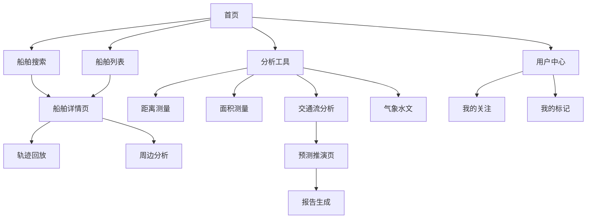

## 1. 产品概述
船舶交通流AIS可视化平台是一个基于Web的SAAS解决方案，专为海事局通航选址分析设计。平台集成AIS数据可视化、船舶动态监控、交通流分析预测等功能，为海事管理部门和航运企业提供专业的船舶交通分析服务。

通过网页端操作实现数据出图效果，支持在线向客户展示分析结果，同时提供小型化的船讯网功能端，支持网页版和APP小程序访问。

## 2. 核心功能

### 2.1 用户角色
| 角色 | 注册方式 | 核心权限 |
|------|----------|----------|
| 普通用户 | 邮箱注册 | 浏览基础船舶信息、查询船舶轨迹 |
| 专业用户 | 付费升级 | 使用分析工具、导出报告、预测功能 |
| 企业用户 | 企业认证 | 多账号管理、API接入、定制服务 |
| 管理员 | 内部创建 | 系统管理、用户管理、数据配置 |

### 2.2 功能模块
平台包含以下核心页面：
1. **首页**: 全球船舶实时分布图、搜索功能、快捷工具入口
2. **船舶详情页**: 船舶基本信息、实时动态、历史轨迹
3. **分析工具页**: 交通流分析、距离测量、面积测量、气象水文
4. **预测推演页**: 基于历史数据的交通流预测、航线规划
5. **用户中心**: 个人设置、关注船舶、标记管理、使用记录
6. **数据报告页**: 分析报告生成、数据导出、图表展示

### 2.3 页面详情
| 页面名称 | 模块名称 | 功能描述 |
|----------|----------|----------|
| 首页 | 全球地图 | 显示世界地图，实时展示船舶位置分布，支持缩放和拖拽 |
| 首页 | 搜索栏 | 支持按船名、呼号、MMSI、IMO、港口等条件搜索船舶 |
| 首页 | 工具面板 | 提供测量工具、图层控制、筛选器等快捷功能入口 |
| 首页 | 船舶列表 | 显示当前可视区域内的船舶列表，支持排序和筛选 |
| 船舶详情页 | 基本信息 | 展示船舶名称、类型、尺寸、国籍、所属公司等基础信息 |
| 船舶详情页 | 实时动态 | 显示当前位置、航向、航速、状态等实时数据 |
| 船舶详情页 | 轨迹回放 | 支持选择时间段回放船舶历史航行轨迹 |
| 船舶详情页 | 周边船舶 | 显示周边一定范围内的其他船舶分布情况 |
| 分析工具页 | 距离测量 | 在地图上测量两点或多点间的航线距离 |
| 分析工具页 | 面积测量 | 测量海域区域面积，支持多边形绘制 |
| 分析工具页 | 气象水文 | 叠加显示气象数据（风向、风速）和水文信息 |
| 分析工具页 | 交通流分析 | 分析特定区域的船舶交通密度和流量分布 |
| 预测推演页 | 历史数据分析 | 基于1-3年历史数据进行交通流趋势分析 |
| 预测推演页 | 未来预测 | 预测未来几年的交通流分布变化情况 |
| 预测推演页 | 航线优化 | 根据预测结果提供航线规划建议 |
| 用户中心 | 我的关注 | 管理用户关注的船舶和区域 |
| 用户中心 | 我的标记 | 管理在地图上添加的自定义标记点 |
| 用户中心 | 使用记录 | 查看功能使用历史和生成的报告记录 |
| 数据报告页 | 报告生成 | 根据分析结果生成专业的数据报告 |
| 数据报告页 | 数据导出 | 支持导出图表、数据表格等分析结果 |
| 数据报告页 | 报告模板 | 提供多种报告模板供用户选择 |

## 3. 核心流程

### 3.1 用户访问流程
用户访问平台 → 浏览全球船舶分布 → 搜索特定船舶 → 查看船舶详情 → 使用分析工具 → 生成报告 → 导出数据

### 3.2 交通流分析流程
选择分析区域 → 设置时间范围 → 选择分析维度 → 运行分析算法 → 查看分析结果 → 导出分析报告

### 3.3 预测推演流程
选择历史数据范围 → 配置预测参数 → 运行预测算法 → 查看预测结果 → 对比历史趋势 → 生成预测报告

## 4. 用户界面设计

### 4.1 设计风格
- **主色调**: 深海蓝(#1f3b6d)为主导航栏背景，配合白色文字
- **强调色**: 亮蓝色(#1976d2)用于按钮和重要操作元素
- **数据点**: 绿色(#12b312)表示船舶位置点
- **背景色**: 浅米色陆地配合中蓝色海洋的地图配色
- **按钮样式**: 扁平化设计，主要按钮使用圆角矩形
- **字体**: 简体中文为主，主要使用14-16px字体大小
- **布局**: 左侧地图主区域，右侧可折叠工具面板
- **图标风格**: 简洁的线性图标，符合海事主题

### 4.2 页面设计概述
| 页面名称 | 模块名称 | UI元素 |
|----------|----------|--------|
| 首页 | 导航栏 | 深蓝色背景，白色文字，包含logo、主要功能菜单和用户入口 |
| 首页 | 搜索区域 | 白色搜索框，蓝色搜索按钮，占位符文字为灰色 |
| 首页 | 地图区域 | 占据主要空间，显示世界地图和船舶分布，支持缩放和拖拽 |
| 首页 | 工具面板 | 右侧白色面板，包含分组的功能图标和文字说明 |
| 首页 | 状态栏 | 左下角半透明灰色面板，显示当前坐标、比例尺等信息 |
| 船舶详情页 | 信息卡片 | 白色背景卡片，分组显示船舶各类信息 |
| 船舶详情页 | 轨迹控制 | 时间轴控制器，支持播放、暂停、快进等操作 |
| 分析工具页 | 工具栏 | 顶部工具栏，包含各种分析工具的切换按钮 |
| 分析工具页 | 结果展示 | 地图叠加层显示分析结果，侧边栏显示详细数据 |
| 预测推演页 | 参数设置 | 左侧设置面板，可配置预测的时间范围和算法参数 |
| 预测推演页 | 结果对比 | 分屏或图层切换显示历史数据和预测结果 |

### 4.3 响应式设计
- **桌面优先**: 主要面向桌面端用户设计，充分利用大屏幕空间
- **移动端适配**: 支持平板和手机访问，采用响应式布局
- **触摸优化**: 移动端支持触摸手势操作地图
- **自适应布局**: 根据屏幕尺寸自动调整面板位置和大小

### 4.4 地图可视化规范
- **坐标显示**: 支持多种坐标格式（DDM、DMS、Decimal）
- **比例尺**: 动态显示当前地图比例尺
- **图层控制**: 支持切换不同的地图底图和数据图层
- **数据密度**: 根据缩放级别自动调整船舶点的显示密度
- **交互反馈**: 鼠标悬停显示船舶基本信息，点击显示详细信息